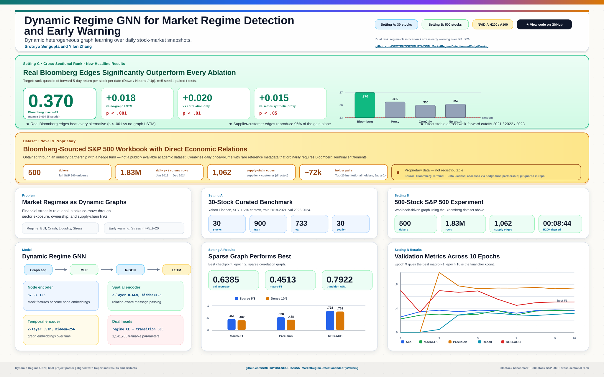

# GNN Market Regime Detection and Early Warning

This repository contains a financial graph learning project for market regime detection and early warning.

The project models the equity market as a sequence of heterogeneous graphs and predicts:

- the current market regime: `Bull`, `Crash`, `Liquidity`, `Stress`
- whether a `Stress` regime is likely to appear in the next `5-20` trading days

Read the full project report: [Report.md](./Report.md).



## Project Status

- **Original scope (ECE538 course project):** everything described in this
  README and in [Report.md](./Report.md) / [RESULTS.md](./RESULTS.md),
  frozen at git tag [`v1.0-ece538-submission`](../../releases/tag/v1.0-ece538-submission).
- **Post-submission extensions:** tracked in [CHANGELOG.md](./CHANGELOG.md).
  Compare the current state to the submitted baseline with
  `git diff v1.0-ece538-submission..main`.

## New results

A cross-sectional 5-day forward return rank classification task evaluates
the heterogeneous-graph approach with statistical rigor. Across 5 random
seeds and 3 walk-forward train cutoffs, the dynamic heterogeneous GNN
using real Bloomberg supplier/customer/holder edges significantly
outperforms non-Bloomberg ablations (p < .001 vs no-graph). See
[RESULTS.md](./RESULTS.md) for the full evaluation, statistical tests,
and figures.

- Pipelines: `scripts/run_xsec_rank.py`, `scripts/run_per_stock.py`, `scripts/run_baselines.py`
- Raw experiment outputs: `results/`
- Figures: `figures/v2/`
- Reproduce all tables/figures: `python scripts/analyze_results.py --figures`


## What The Main Project Does

The main idea is to turn the stock market into a dynamic multi-relational graph:

- nodes are stocks
- edges encode relationships between stocks
- graphs evolve daily
- a temporal model consumes a rolling window of graph snapshots

Instead of only predicting returns, the main pipeline predicts:

- `regime_label`: a 4-class description of current market conditions
- `transition_label`: a binary early-warning target that becomes positive when `Stress` appears in the next `5-20` trading days

This makes the project closer to a market monitoring and systemic-risk early-warning system than a standard alpha model.

## Main Project: Dynamic Regime GNN

Directory: [`GNNsMarketRegimeDetection&Early-Warning`](./GNNsMarketRegimeDetection%26Early-Warning)

### Pipeline

The real-data entry point is [`GNNsMarketRegimeDetection&Early-Warning/run_real_data.py`](./GNNsMarketRegimeDetection%26Early-Warning/run_real_data.py).

It does the following:

1. Downloads a curated sample of S&P 500 stocks, plus `SPY` and `^VIX`, from Yahoo Finance.
2. Builds a `37`-dimensional daily feature vector per stock.
3. Computes rule-based market regime labels from SPY returns, realized volatility, and average cross-sectional correlation.
4. Builds daily heterogeneous graphs with three relation types:
   - `correlation`
   - `etf_cohold`
   - `supply_chain`
5. Slices the data into rolling sequences of `T=30` graph snapshots.
6. Trains a dynamic GNN with two heads:
   - a 4-way regime classifier
   - a binary transition / early-warning head

### Model architecture

The main model is defined in [`GNNsMarketRegimeDetection&Early-Warning/models/dynamic_regime_gnn.py`](./GNNsMarketRegimeDetection%26Early-Warning/models/dynamic_regime_gnn.py).

Its structure is:

1. `NodeFeatureEncoder`
   Projects raw stock features from `37 -> 128`.
2. `SpatialRGCN`
   Applies relation-aware message passing over the three edge types.
3. Graph pooling
   Aggregates node embeddings into one graph-level embedding per day.
4. Temporal encoder
   Uses either:
   - `LSTM` by default
   - `Transformer` as an alternative
5. Dual prediction heads
   - `RegimeClassifierHead`
   - `TransitionLogitHead`

In short:

`30 daily heterogeneous graphs -> spatial GNN -> temporal encoder -> current regime + future stress warning`

### Label generation logic

The statistical labeling engine lives in [`GNNsMarketRegimeDetection&Early-Warning/data/label_generator.py`](./GNNsMarketRegimeDetection%26Early-Warning/data/label_generator.py).

It derives four market states using expanding-window thresholds to reduce look-ahead bias:

- `Stress`
  High volatility and high average cross-sectional correlation.
- `Crash`
  Large negative recent return plus elevated volatility.
- `Bull`
  Positive recent return plus relatively low volatility.
- `Liquidity`
  Residual bucket for everything else.

The early-warning target is:

- `transition_label = 1` if a `Stress` regime appears anywhere in the next `5-20` trading days

### Graph construction

Graph building logic lives in [`GNNsMarketRegimeDetection&Early-Warning/data/hetero_dataset.py`](./GNNsMarketRegimeDetection%26Early-Warning/data/hetero_dataset.py).

Each daily graph has one node type, `stock`, and three edge types:

- `correlation`
  Built from rolling return correlations using top-K positive and bottom-K negative neighbors per node.
- `etf_cohold`
  Intended to represent ETF co-holding overlap. If real holdings are not provided, the current prototype falls back to a sector/sub-industry proxy.
- `supply_chain`
  Intended to represent production-network links. If no external adjacency is provided, the current prototype falls back to a sparse synthetic adjacency.

## Repository Structure

```text
.
├── market_regime_gnn/
│   ├── config.py
│   ├── run_real_data.py
│   ├── train.py
│   ├── data/
│   └── models/
├── pyproject.toml
├── uv.lock
├── README.md
└── GNNsMarketRegimeDetection&Early-Warning/
    ├── config.py
    ├── run_real_data.py
    ├── train.py
    ├── data/
    │   ├── hetero_dataset.py
    │   └── label_generator.py
    ├── models/
    │   └── dynamic_regime_gnn.py
    └── tests/
```

## Environment Setup

The repository already includes [`pyproject.toml`](./pyproject.toml) and [`uv.lock`](./uv.lock).

Required runtime stack:

- Python `>=3.11,<3.12`
- `torch`
- `torch-geometric`
- `numpy`
- `pandas`
- `yfinance`

Recommended setup:

```bash
uv sync --dev
```

This creates a local `.venv`, installs runtime and test dependencies from the lockfile, and installs the local project in editable mode so package imports and console scripts work from outside the repo root.

If you prefer not to activate the environment manually, run commands through `uv run`.

## Python API Notes

The installable Python package is exposed as `market_regime_gnn`. The legacy source layout remains under `GNNsMarketRegimeDetection&Early-Warning/` for script compatibility.

The regime-detection project has an import-friendly wrapper package:

```python
from market_regime_gnn import RegimeConfig
from market_regime_gnn.data.label_generator import generate_market_labels
from market_regime_gnn.models.dynamic_regime_gnn import DynamicRegimeGNN
```

The wrapper keeps the legacy source layout working for in-repo scripts, but the installable package now ships a bundled `market_regime_gnn._legacy` implementation so editable installs and built wheels behave the same way.

After `uv sync --dev`, these imports work from any current working directory as long as you use the project environment's Python:

```bash
.venv/bin/python -c "import market_regime_gnn"
```

## Build And Install

Build an sdist and wheel:

```bash
uv build
```

The generated wheel includes the bundled `market_regime_gnn._legacy` package, so isolated installs do not need the repository checkout path to resolve the main regime-detection prototype.

## Data Access

The main 500-stock experiments require a Bloomberg-sourced workbook
(`sp500_prices 1.xlsx`) that is **not included in this repository** because
it is proprietary licensed data through a Hedge Fund's license. Specifically:

- The file is licensed market data sourced via Bloomberg Terminal and the
  Bloomberg Data License program.
- It contains daily price/volume time series for ~500 S&P 500 constituents
  from 2015–2024, plus reference metadata (Top Suppliers, Top Customers,
  Top 20 institutional Holders) per ticker.
- Redistribution to third parties is prohibited under the Bloomberg
  terms of use.

You can potentially recreate an equivalent workbook if you have equivalent access
with two sheets containing the following columns:

| Column | Description |
| --- | --- |
| `date` | Trading day (datetime) |
| `ticker` | Bloomberg ticker (e.g. `AAPL UW`) |
| `px_last` | Daily close price |
| `px_volume` | Daily volume |
| `Ticker` | (metadata row only) Same Bloomberg ticker |
| `Top Suppliers` | Comma-separated supplier tickers (e.g. `FLEX US Equity, ...`) |
| `Top Customers` | Comma-separated customer tickers |
| `Top 20 Holders` | Comma-separated institutional holder names |

Place the file at the path expected by the entry-point scripts:

```bash
# default location used by scripts/
./sp500_prices\ 1.xlsx

## How To Run

Because the main project directory contains `&`, quote that path in shell commands.

### Run the main regime-detection pipeline

```bash
uv run python "GNNsMarketRegimeDetection&Early-Warning/run_real_data.py"
```

Equivalent module entry point:

```bash
uv run python -m market_regime_gnn.run_real_data
```

See available CLI options without starting a run:

```bash
uv run python -m market_regime_gnn.run_real_data --help
```

Installed console script:

```bash
uv run market-regime-real-data --help
```

What it does:

- downloads Yahoo Finance data
- generates regime labels
- builds temporal heterogeneous graphs
- trains the dynamic regime GNN
- prints validation metrics and prediction statistics
- uses `--train-cutoff` as the last training day and starts validation on the next calendar day
- currently uses a fixed curated 30-stock sample instead of a user-configurable universe size

For the real-data CLI, `--train-cutoff` must lie inside the inclusive `[--start, --end]` range. Validation begins on the next calendar day after the cutoff, so if `--train-cutoff` equals `--end`, the validation split is intentionally empty.
If the training split becomes empty after the model's warm-up and label horizon rules are applied, the script fails fast with a clear error telling you to widen the training window.
The `--device` option accepts `cpu`, `cuda`, `cuda:0`, or `mps`. Unsupported or unavailable accelerators fail fast before the run proceeds, and the quick sanity-check forward pass uses the same device as training.
The CLI validates integer hyperparameters before downloading data: `--epochs`, `--batch-size`, and `--grad-accum-steps` must be positive; correlation-neighbour counts must be non-negative; and `--seq-len` and `--rolling-zscore-window` must be positive.
When a CLI argument is invalid, the script returns a normal argparse `usage: ... error: ...` message instead of a Python traceback. Runtime/data failures that happen after argument parsing still surface as normal runtime errors rather than being mislabeled as usage mistakes.

## Testing And Smoke Checks

Recommended full test command:

```bash
uv run pytest -q
```

Validated locally:

```bash
uv run pytest -q
uv build
uv run python "GNNsMarketRegimeDetection&Early-Warning/data/hetero_dataset.py"
uv run python "GNNsMarketRegimeDetection&Early-Warning/models/dynamic_regime_gnn.py"
uv run python "GNNsMarketRegimeDetection&Early-Warning/train.py"
```

Notes:

- `uv run pytest -q` covers lightweight main-project smoke tests, CLI validation, and import-regression tests.
- The project now includes setuptools build metadata and console scripts, so `uv sync --dev` and `uv build` produce importable packages instead of relying only on the repo root being on `sys.path`.
- The `market_regime_gnn` package now bundles the main prototype's legacy implementation, which avoids wheel-install regressions caused by resolving modules from the checkout path.
- Dataset boundary tests now guard against over-trimming early valid samples in the regime-detection dataset.
- The new `market_regime_gnn` wrapper is covered by root-level tests so main-project labeling logic can be imported without relying on ad hoc `sys.path` edits.
- The real-data entry point now provides a real `--help` path instead of immediately starting downloads and training.
- Script-mode import fallbacks are now guarded so package imports raise real dependency errors instead of silently dropping into `sys.path` hacks.
- The real-data scripts depend on Yahoo Finance availability and network access.

## Current Limitations

- The main regime branch still uses proxy relations for `etf_cohold` and `supply_chain` unless external datasets are provided.
- The market-regime branch has smoke checks, but its dedicated in-project `tests/` package is still sparse.
- Real-data runs pull directly from Yahoo Finance, so reproducibility depends on upstream data availability and any ticker-history revisions.

## Recent Fixes

The following issues were addressed while updating this repository:

- README was aligned with the current repo state: `pyproject.toml`, `uv.lock`, `uv`-based setup, and validated commands are now documented accurately.
- Deprecated Pandas `fillna(method=...)` calls in the real-data and labeling code were replaced with `.ffill()` / `.bfill()` equivalents for forward compatibility.
- Dataset warm-up boundary logic was corrected so the regime-detection dataset keeps the earliest valid supervised samples instead of silently dropping them.
- The main regime-detection prototype now has a wrapper package and relative-import-friendly internals, so it can be imported programmatically despite the legacy directory name.
- The wrapper package no longer depends on the repository checkout path at runtime, so isolated wheel installs can import `market_regime_gnn` successfully.
- Shared default `RegimeConfig()` constructor arguments were replaced with per-call `None` sentinels, avoiding accidental cross-instance config reuse.
- Import fallback branches now distinguish direct script execution from package imports, preventing misleading fallback behavior when a real dependency import fails.

## One-Sentence Summary

This repository is a financial GNN research workspace which is centered on dynamic heterogeneous graphs for market regime detection and early warning.
