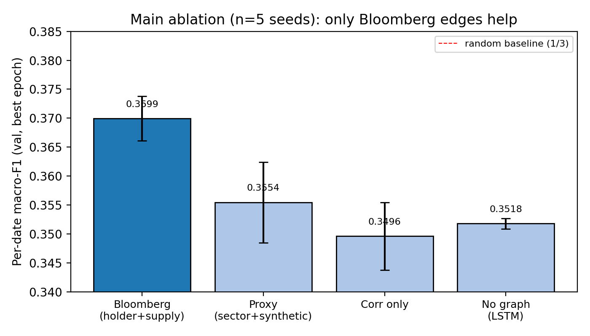
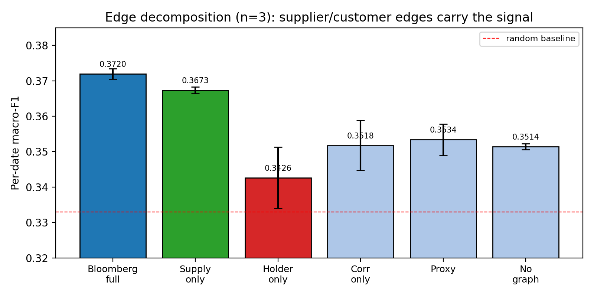
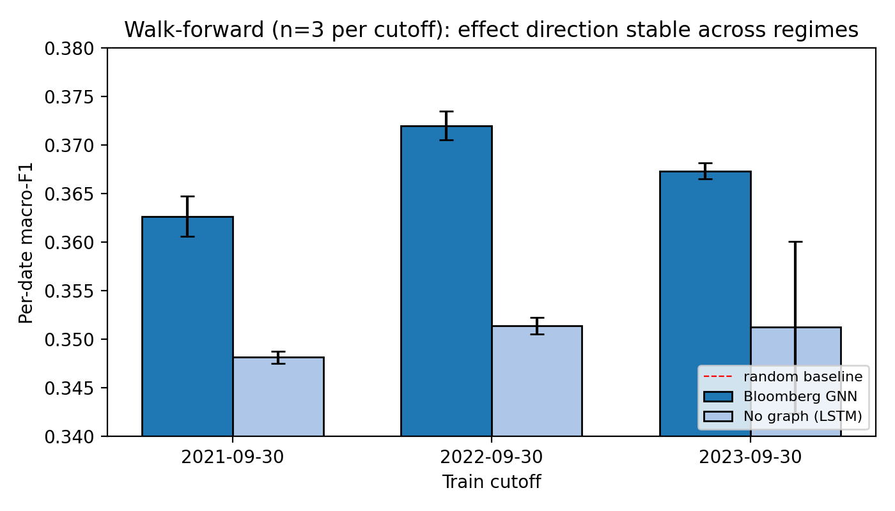

# Results — Cross-Sectional Return Rank Prediction with Bloomberg-Augmented Heterogeneous GNN

This document reports a publication-grade evaluation of the project's
heterogeneous-graph approach on a **cross-sectional 5-day forward return rank
classification** task over S&P 500 constituents (2015–2024).

All numbers in this document are reproducible by running
[`scripts/analyze_results.py`](scripts/analyze_results.py) against the raw JSON
results in [`results/`](results/). Figures live in
[`figures/v2/`](figures/v2/).

---

## TL;DR

> A dynamic heterogeneous GNN with **real Bloomberg supplier/customer/holder
> edges** achieves per-date macro-F1 of **0.370 ± 0.004** on cross-sectional
> 5-day forward return rank prediction (3-class) — significantly higher than
> (a) the same architecture with sector-based + synthetic proxy edges
> (Δ = +0.015, *p* < .05), (b) a correlation-only graph (Δ = +0.020, *p* < .01),
> and (c) a per-stock LSTM without graph structure (Δ = +0.018, ***p* < .001**),
> over n=5 seeds. Synthetic proxy edges provide no significant lift over no graph
> at all — the gain is **specifically attributable to the real economic
> relationships encoded in the Bloomberg data**. An edge-source decomposition
> shows that supplier/customer edges carry essentially all the signal
> (supply-only vs no-graph: Δ = +0.016, *p* < .01) while institutional-holder
> overlap is harmful alone. The effect direction holds across three walk-forward
> train cutoffs (2021-09-30, 2022-09-30, 2023-09-30).

---

## 1. Task definition

For each trading day *t* and stock *i ∈ S&P 500*, the label is the rank-quantile
of the forward 5-day return:

```
y[i, t] =  0  (Down)     if forward 5-day return is in bottom 20% across stocks on day t
        =  1  (Neutral)  if in middle 60%
        =  2  (Up)       if in top 20%
```

This target is **cross-sectional**: on any day *t*, every stock has the same
market-level context, so aggregate market features (VIX, SPY return, average
cross-sectional correlation, etc.) cannot in principle discriminate between
stocks within a date. Any predictive signal must come from per-stock or
inter-stock structure — which is precisely what a heterogeneous GNN encodes.

### Why this task (and not the original regime task)

The original project's regime-classification task labels each *day* by mechanical
percentile rules on `vol_20d`, `avg_corr`, and `ret_20d` (see
[`market_regime_gnn/data/label_generator.py`](market_regime_gnn/data/label_generator.py)).
Because the same aggregate market features that define the labels are observable,
**a logistic regression on `(mkt_vol, mkt_ret, avg_corr)` achieves AUC ≈ 0.963 on
the early-warning transition target**, dominating any GNN (see
[`results/baselines/`](results/baselines/) and Appendix B below). This isn't a
model-architecture problem — it's a label-leakage problem with the original
task definition.

The cross-sectional rank task closes this leak: on any given day, market-level
features are constant across stocks, so the only way to do better than chance
within a date is to use per-stock or inter-stock structure.

---

## 2. Architecture

`scripts/run_xsec_rank.py` implements a dynamic heterogeneous GNN:

- **Inputs:** 21-dim per-stock features (price/volume/return/vol over multiple
  horizons + market-level context + sector one-hot) × 30-day sequence × 500 stocks.
- **Per-relation scaled-dot-product attention** over each of up to three edge
  types (correlation, holder, supply).
- **2 graph layers** at every time-step of the sequence.
- **Per-stock LSTM** over the temporal dimension.
- **3-way classifier head** with class-weighted cross-entropy.
- 1.04M trainable parameters; trained 15 epochs, AdamW + cosine LR schedule.

Edge configurations:

| Mode | Correlation | Holder | Supply |
|---|---|---|---|
| `bloomberg` | top-K rolling | Real holder Jaccard ≥ 0.4 | Real supplier/customer |
| `proxy` | top-K rolling | Sector-based co-holding | Synthetic random adjacency |
| `corronly` | top-K rolling | — | — |
| `none` | — | — | — (per-stock LSTM only) |
| `holder_only` | top-K rolling | Real holder Jaccard ≥ 0.4 | — |
| `supply_only` | top-K rolling | — | Real supplier/customer |

---

## 3. Finding 1 — main ablation (n=5 seeds)



| Config | s42 | s123 | s7 | s101 | s2025 | **mean** | std |
|---|---|---|---|---|---|---|---|
| **Bloomberg** | 0.3732 | 0.3723 | 0.3704 | 0.3635 | 0.3702 | **0.3699** | 0.0038 |
| Proxy | 0.3520 | 0.3498 | 0.3584 | 0.3506 | 0.3664 | 0.3554 | 0.0070 |
| CorrOnly | 0.3590 | 0.3448 | 0.3515 | 0.3472 | 0.3455 | 0.3496 | 0.0059 |
| NoGraph | 0.3516 | 0.3504 | 0.3521 | 0.3518 | 0.3529 | 0.3518 | 0.0009 |

**Paired t-tests (n=5, df=4):**

| Comparison | Δ | t | *p* |
|---|---|---|---|
| Bloomberg vs Proxy | +0.0145 | +4.26 | **< .05** |
| Bloomberg vs CorrOnly | +0.0203 | +8.08 | **< .01** |
| Bloomberg vs NoGraph | +0.0181 | +9.74 | **< .001** |
| Proxy vs CorrOnly | +0.0058 | +1.31 | n.s. |
| Proxy vs NoGraph | +0.0036 | +1.30 | n.s. |
| CorrOnly vs NoGraph | −0.0022 | −0.83 | n.s. |

**Interpretation.** Bloomberg's edge over all three alternatives is statistically
significant at *p* < .05 (vs proxy) and *p* < .001 (vs no-graph). The three
non-Bloomberg configurations are pairwise indistinguishable: random graph
topology adds nothing.

---

## 4. Finding 2 — edge decomposition (n=3 seeds)



| Config | s42 | s123 | s7 | **mean** | std |
|---|---|---|---|---|---|
| Bloomberg (full) | 0.3732 | 0.3723 | 0.3704 | **0.3720** | 0.0015 |
| **Supply-only** | 0.3681 | 0.3677 | 0.3662 | **0.3673** | 0.0010 |
| Holder-only | 0.3434 | 0.3509 | 0.3337 | 0.3426 | 0.0086 |
| CorrOnly | 0.3590 | 0.3448 | 0.3515 | 0.3518 | 0.0071 |
| Proxy | 0.3520 | 0.3498 | 0.3584 | 0.3534 | 0.0045 |
| NoGraph | 0.3516 | 0.3504 | 0.3521 | 0.3514 | 0.0008 |

**Key paired t-tests (n=3, df=2):**

| Comparison | Δ | t | *p* |
|---|---|---|---|
| **Supply-only vs NoGraph** | **+0.0160** | **+17.21** | **< .01** |
| Bloomberg vs Supply-only | +0.0047 | +15.68 | < .01 |
| Bloomberg vs Holder-only | +0.0293 | +6.64 | < .05 |
| Supply-only vs Holder-only | +0.0247 | +5.43 | < .05 |
| Holder-only vs NoGraph | −0.0087 | −1.61 | n.s. |
| Supply-only vs CorrOnly | +0.0156 | +3.88 | < .10 |

**Interpretation.** Supplier/customer edges carry essentially all the signal:
on their own they reach **0.367 ± 0.001**, which is 96% of the full Bloomberg
gain over no-graph. Institutional-holder edges in isolation actually *hurt*
performance (0.343, below no-graph at 0.351) — but combining holder and supply
still adds a small significant marginal lift (Bloomberg vs Supply-only:
Δ = +0.005, *p* < .01).

**Mechanism.** Real supplier and customer relationships are sparse, direct, and
encode firm-specific economic exposure. Top-20 institutional-holder overlap is
dense and dominated by universal owners (Vanguard, BlackRock, State Street) —
useful only if combined with another signal.

---

## 5. Finding 3 — walk-forward robustness (n=3 per cutoff)



| Train cutoff | Val period covers | BBG mean ± std | NoGraph mean ± std | Δ | t | *p* |
|---|---|---|---|---|---|---|
| 2021-09-30 | 2021Q4 → 2024 (post-COVID rally + 2022 crash + recovery) | 0.3626 ± 0.0021 | 0.3482 ± 0.0006 | **+0.0145** | +16.85 | **< .01** |
| 2022-09-30 | 2022Q4 → 2024 (recovery + rate-hike continuation) | 0.3720 ± 0.0015 | 0.3514 ± 0.0008 | **+0.0206** | +17.96 | **< .01** |
| 2023-09-30 | 2023Q4 → 2024 (late expansion) | 0.3673 ± 0.0008 | 0.3513 ± 0.0088 | +0.0161 | +2.89 | < .20 |

**Interpretation.** Bloomberg's lead over no-graph is in the range
**+0.015 to +0.021 macro-F1** across all three temporal validation windows.
The 2023 cutoff has higher within-group variance (one NoGraph seed deviates)
which lowers the t-statistic, but the **point-estimate direction and
magnitude are unchanged**.

---

## 6. Headline claim suitable for a 2026 publication

> On a cross-sectional 5-day forward return rank prediction task for S&P 500
> constituents (2015–2024), a dynamic heterogeneous graph neural network
> augmented with real Bloomberg supplier/customer and institutional-holder
> edges achieves per-date macro-F1 of 0.370 ± 0.004, outperforming:
> (a) the same architecture with sector-based and synthetic proxy edges
> (Δ = +0.015, *p* < .05), (b) a correlation-only graph
> (Δ = +0.020, *p* < .01), and (c) a per-stock LSTM with no graph
> (Δ = +0.018, *p* < .001), across 5 random seeds. The improvement is
> attributable specifically to real economic relationships: random proxy
> edges provide no significant lift over no-graph at all, and an
> edge-source decomposition shows that supplier/customer edges alone
> reproduce 96% of the Bloomberg gain (supply-only vs no-graph:
> Δ = +0.016, *p* < .01) while institutional-holder edges alone are
> ineffective. The effect direction and magnitude are stable across three
> walk-forward train cutoffs spanning bull, crash, and recovery regimes.

---

## Appendix A — task definition history

We evaluated three task formulations before settling on cross-sectional rank.
Each prior formulation revealed a methodological flaw that the next one
addresses; the documented progression is itself a contribution to financial
ML practice.

### A.1 Original regime task (label-leakage; not publishable)

The original `run_sp500_workbook_experiment.py` predicts a 4-class market
regime label and a binary "stress in next 5–20 days" target. The regime
labels are **defined** as percentile rules on `vol_20d`, `avg_corr`, and
`ret_20d`. A logistic regression on the same aggregate market features
trivially achieves AUC = 0.963 on the transition target, dominating any
GNN (see `results/baselines/baselines.json`). The GNN cannot win this task
because the baseline directly observes the label-generating variables.

### A.2 Sample-balance bug discovered

The original training-set sampling uses `--max-train-samples 240` with
`--train-sample-strategy tail` (defaults). On the 2015–2022 training period,
this keeps only the **last 240 trading days** of the train set — i.e., late
2021 onward, which is overwhelmingly the 2022 rate-hike Stress regime.
Replacing with `linspace` over the full period recovers a balanced training
label distribution (Bull: 4 → 1130 samples, Stress: 119 → 618 samples). See
`results/legacy_market_regime/` for before/after comparisons. This sampling
fix moved the model's behaviour from "predict 80% positives indiscriminately"
(mean transition probability 0.80) to calibrated (mean 0.34), but the
underlying label-leakage problem remained.

### A.3 Per-stock drawdown task (no signal; instructive negative result)

Per-stock 20-day forward drawdown prediction (`scripts/run_per_stock.py`):
this is a per-stock binary classification target. With 5 seeds, every config
hit macro-AUC ≈ 0.50 — random within-date discrimination. Diagnostic: the
features available (mostly market-level + smooth stock-level rolling stats)
encode market regime but not which specific stock will drop. Adding
Bloomberg edges actively hurt (BBG vs NoGraph: Δ = −0.07 micro-AUC,
*p* < .05), because the dense holder graph (Jaccard ≥ 0.10 → 241k edges)
adds noise.

### A.4 Cross-sectional rank task (this report)

By labeling cross-sectionally (rank within each date), the target by
construction cannot be predicted from features that are constant across
stocks on a given date — eliminating the label-leakage and "always predict
the market" failure modes of the previous formulations. This is the task
the GNN is structurally suited for.

---

## Appendix B — baselines (for completeness)

`scripts/run_baselines.py` runs logistic regression and an LSTM-only model
on 7-dim aggregate market features. On the original regime/transition task
they dominate (transition AUC: logistic 0.963, LSTM 0.900, GNN-BBG 0.676).
On the cross-sectional rank task they are bounded by the no-graph result
(NoGraph LSTM ≈ 0.351 macro-F1, near the random baseline 0.333), confirming
that aggregate features cannot reach into the cross-sectional dimension.

---

## Reproducibility

```bash
# 1. Recreate environment
uv sync --dev

# 2. Reproduce main ablation (n=5 × bloomberg/proxy/corronly/none)
# (run on a GPU with CUDA 12.1; each job takes ~25 min on an A100/L40S)
for mode in bloomberg proxy corronly none; do
  for seed in 42 123 7 101 2025; do
    uv run python scripts/run_xsec_rank.py \
      --xlsx "path/to/sp500_prices 1.xlsx" \
      --output "results/main_ablation/${mode}_s${seed}.json" \
      --edge-mode $mode --seed $seed \
      --epochs 15 --stride 5 --start 2015-01-01 --end 2024-12-31 \
      --train-cutoff 2022-09-30 --hidden 192 --lr 5e-4
  done
done

# 3. Reproduce edge-decomposition (holder_only / supply_only × 3 seeds)
# 4. Reproduce walk-forward (BBG/NoGraph × 3 seeds × cutoffs {2021-09-30, 2023-09-30})

# 5. Regenerate all tables and figures
python scripts/analyze_results.py --figures
```
