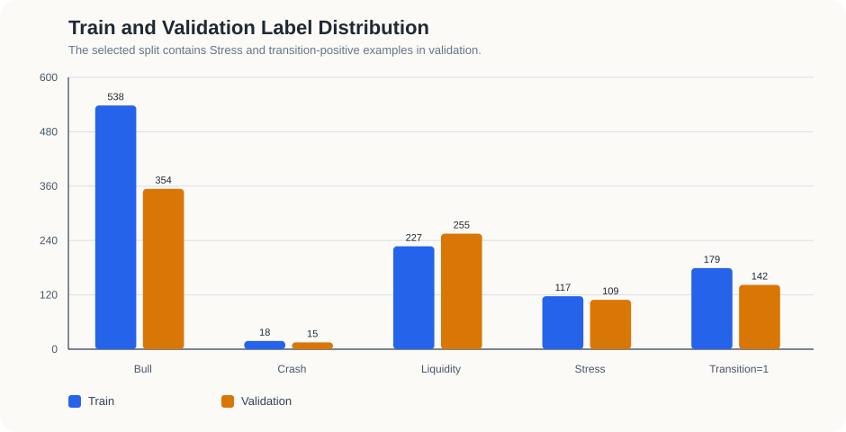
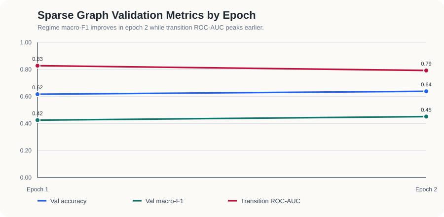
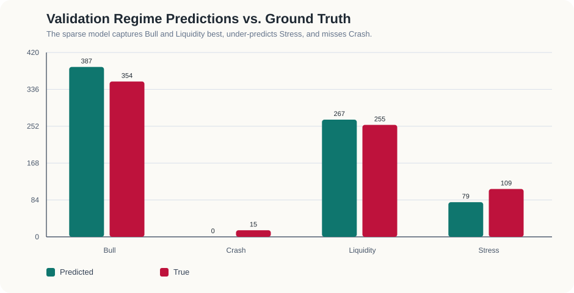
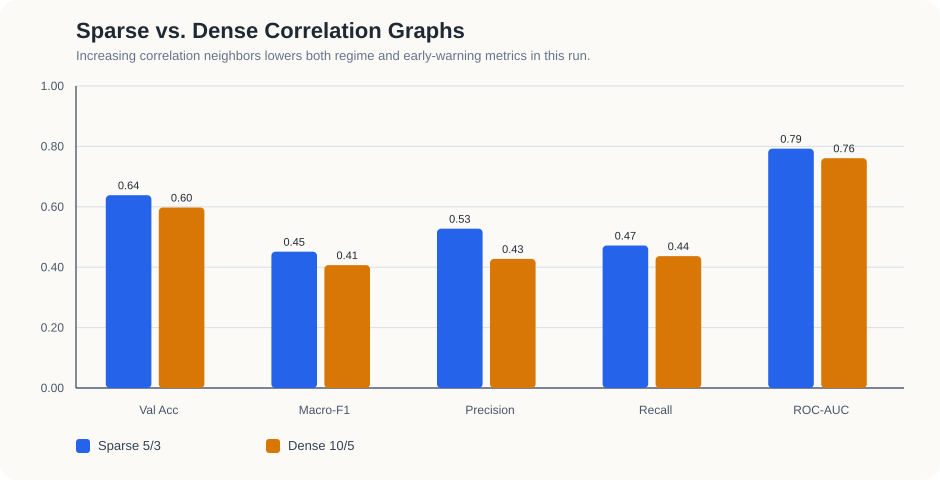
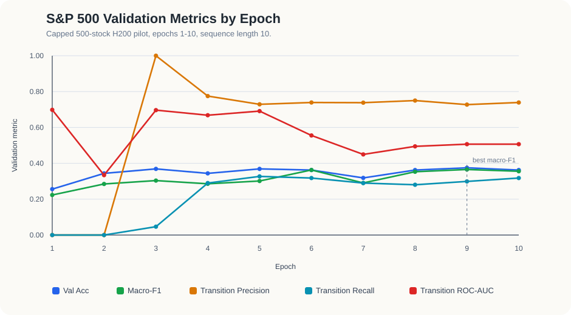
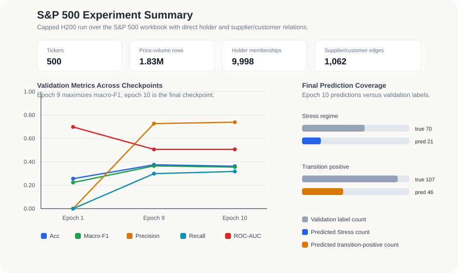

# Dynamic Regime GNN for Market Regime Detection and Early Warning

Srotriyo Sengupta and Yifan Zhang

ECE538 Project Report

## Abstract

This project studies market regime detection as a dynamic heterogeneous graph learning problem. Each trading day is represented as a graph whose nodes are stocks and whose relation types encode rolling return correlation, co-ownership, and supply-chain structure. A temporal graph model consumes a window of daily graph snapshots and jointly predicts the current market regime and whether a future stress regime will appear within a 5-20 trading-day warning horizon.

The empirical study is organized around two settings. **Setting A** is a curated 30-stock benchmark using Yahoo Finance data and a validation window from 2022-2024. In this setting, the best sparse-correlation H200 run reaches validation accuracy `0.6385`, regime macro-F1 `0.4513`, transition ROC-AUC `0.7922`, transition precision `0.5276`, and transition recall `0.4718`. A denser correlation graph performs worse, suggesting that graph sparsity matters for this small universe. **Setting B** is a 500-stock S&P 500 workbook pilot using `sp500_prices 1.xlsx`, which contains 1.83 million daily price-volume rows and direct supplier, customer, and institutional-holder metadata. A capped 10-epoch H200 job completes in `00:08:44`, verifies end-to-end scalability to 500 nodes, and begins to recover stress and transition-positive examples, but remains underfit. Overall, the project provides a reproducible research prototype for graph-based market monitoring, with the 30-stock setting serving as the main predictive benchmark and the 500-stock setting serving as the scaling and data-integration study.

## 1 Introduction

Financial markets are relational systems. Stocks co-move because they share macro exposures, sectors, ownership structure, and production-network dependencies. These relationships become especially important during systemic stress, when correlations rise and diversification weakens. A model that treats stocks as independent sequences therefore misses a central part of the regime-detection problem.

This project represents the market as a sequence of daily heterogeneous graphs. The model predicts two outputs from each graph sequence: a four-class regime label, `Bull`, `Crash`, `Liquidity`, or `Stress`; and a binary early-warning label indicating whether `Stress` appears soon. This dual-task formulation separates contemporaneous market-state recognition from forward-looking risk monitoring.

The main contributions are:

- A dynamic graph formulation of market regime detection and stress early warning.
- A dual-head temporal graph neural network over rolling stock-market graph snapshots.
- A reproducible 30-stock benchmark with validation stress events and a graph-sparsity comparison.
- A 500-stock workbook pilot that uses direct holder and supplier/customer metadata to test scaling beyond proxy relations.

## 2 Method

### 2.1 Labels and Tasks

The regime labels are generated from observable market statistics rather than external annotations. For each day, the labeling rule uses 20-day SPY return, 20-day realized volatility, and average cross-sectional stock correlation. Thresholds are computed with expanding windows to reduce look-ahead bias.

The four classes are assigned by a priority rule:

| Regime | Definition |
| --- | --- |
| `Stress` | High realized volatility and high cross-sectional correlation |
| `Crash` | Strong negative market return with elevated volatility |
| `Bull` | Positive market return with relatively low volatility |
| `Liquidity` | Residual mixed or moderate state |

The forward-looking target is

```text
transition_label_t = 1[Stress appears between t+5 and t+20].
```

This target asks whether the model can identify early warning signals before an observable stress episode.

### 2.2 Dynamic Heterogeneous Graph

Each daily graph has one node type, `stock`, and three edge types:

| Component | Construction |
| --- | --- |
| Node features | 37 daily price, volume, technical, volatility, sector, market, and correlation features per stock |
| `correlation` edges | Rolling return-correlation graph with top-K positive and bottom-K negative neighbors |
| `etf_cohold` edges | Co-ownership relation, using holder metadata in the 500-stock workbook and proxy structure in the 30-stock benchmark |
| `supply_chain` edges | Supplier/customer relation, using workbook metadata in the 500-stock pilot and proxy structure in the 30-stock benchmark |

The model receives a rolling window of graph snapshots. The main 30-stock experiments use `seq_len = 30`; the capped 500-stock pilot uses `seq_len = 10` to keep the GPU job short while testing the full 500-node graph path.

### 2.3 Model and Objective

The Dynamic Regime GNN first projects each 37-dimensional node feature vector into a hidden representation, applies relation-aware graph message passing, pools node embeddings into one graph embedding per day, and feeds the resulting sequence into an LSTM. Two heads predict the regime and transition labels.

The default model uses a `37 -> 128` node encoder, a 2-layer R-GCN with hidden size `128`, mean graph pooling, and a 2-layer unidirectional LSTM with hidden size `256`. The regime head has hidden size `128`; the transition head has hidden size `64`. This configuration contains `1,141,783` trainable parameters.

Training minimizes a dual-task loss:

```text
L_total = L_regime + L_transition
```

where `L_regime` is focal cross-entropy with label smoothing and `L_transition` is binary cross-entropy with logits. Optimization uses AdamW, gradient clipping, gradient accumulation, warmup, and a decayed learning rate schedule.

## 3 Experiments

The study uses two main experimental settings: a 30-stock predictive benchmark and a 500-stock scaling pilot.

### 3.1 Setting A: 30-Stock Curated Benchmark

Setting A uses Yahoo Finance data for a curated 30-stock universe, plus `SPY` and `^VIX` as market context. The split is designed so that the validation window contains real `Stress` and transition-positive examples.

| Item | Value |
| --- | --- |
| Data range fetched | `2018-01-01` to `2025-12-31` |
| Train range | `2018-01-01` to `2021-12-31` |
| Validation range | `2022-01-01` to `2024-12-31` |
| Device | NVIDIA H200, `cuda` |
| PyTorch | `2.11.0+cu130` |
| Epochs | `2` |
| Batch size | `1` |
| Learning rate | `5e-4` with `10` warmup steps |
| Sequence length | `30` |
| Sparse graph | `corr_top_k = 5`, `corr_bot_k = 3` |
| Dense comparison graph | `corr_top_k = 10`, `corr_bot_k = 5` |
| Train / validation samples | `900 / 733` |

Label counts for Setting A are:

| Split | Samples | Bull | Crash | Liquidity | Stress | `transition=1` |
| --- | ---: | ---: | ---: | ---: | ---: | ---: |
| Train | 900 | 538 | 18 | 227 | 117 | 179 |
| Validation | 733 | 354 | 15 | 255 | 109 | 142 |



### 3.2 Setting B: 500-Stock Workbook Pilot

Setting B uses the local workbook `sp500_prices 1.xlsx`. This setting is not yet a full benchmark; it is a scaling and data-integration pilot for the full 500-stock graph.

The workbook audit shows a complete daily panel:

| Workbook statistic | Value |
| --- | ---: |
| Sheets | `2` |
| Price / volume rows | `1,826,500` |
| Date range | `2015-01-01` to `2024-12-31` |
| Unique dates | `3,653` |
| Unique stock tickers | `500` |
| Tickers with full date coverage | `500` |
| Median dates per ticker | `3,653` |
| Non-null price observations | `1,716,943` |
| Non-null volume observations | `1,716,943` |

It also contains relationship metadata:

| Relation field | Coverage / count |
| --- | ---: |
| Tickers with supplier lists | `491 / 500` |
| Raw supplier edges | `2,353` |
| Unique supplier counterparties | `1,161` |
| Tickers with customer lists | `466 / 500` |
| Raw customer edges | `2,078` |
| Unique customer counterparties | `1,144` |
| Tickers with top-20 holder lists | `500 / 500` |
| Unique holders | `689` |
| Holder-sharing stock pairs | `123,556` |

The final H200 workbook pilot used all 500 tickers, direct holder-sharing edges, direct supplier/customer edges inside the S&P 500 universe, a shortened graph sequence, and capped sample counts.

| Workbook H200 pilot item | Value |
| --- | ---: |
| Slurm job ID | `7944025` |
| Requested allocation | `1` H200, `140G`, `2:00:00` |
| Actual Slurm elapsed time | `00:08:44` |
| Training-loop time | `375.6 s` |
| Stocks / dates | `500 / 2,557` |
| Train / validation samples | `240 / 160` |
| Epochs | `10` |
| Sequence length | `10` |
| Correlation graph | `corr_top_k = 3`, `corr_bot_k = 1` |
| Holder memberships | `9,998` |
| Supplier/customer edges inside universe | `1,062` |

The first epoch took `188.4 s` because the run populated the graph snapshot cache. Later epochs took about `21 s` each. For the capped 500-stock configuration, a useful planning estimate is about `2.5` minutes of data preparation, `3.1` minutes for the first epoch, and `0.35` minutes for each additional epoch.

## 4 Results

### 4.1 Setting A: 30-Stock Results

The best 30-stock checkpoint is epoch 2 of the sparse-correlation run.

| Metric | Value |
| --- | ---: |
| Validation loss | 1.6267 |
| Regime accuracy | 0.6385 |
| Regime macro-F1 | 0.4513 |
| Transition accuracy | 0.8158 |
| Transition precision | 0.5276 |
| Transition recall | 0.4718 |
| Transition ROC-AUC | 0.7922 |
| Training time for 2 epochs | 311.1 s |



Per-class validation accuracy shows that the model mainly learns `Bull`, `Liquidity`, and part of `Stress`, while `Crash` remains too rare in this split:

| Regime | Accuracy |
| --- | ---: |
| `Bull` | 0.8023 |
| `Crash` | 0.0000 |
| `Liquidity` | 0.5294 |
| `Stress` | 0.4495 |

Validation prediction counts are:

| Regime | Predicted | True |
| --- | ---: | ---: |
| `Bull` | 387 | 354 |
| `Crash` | 0 | 15 |
| `Liquidity` | 267 | 255 |
| `Stress` | 79 | 109 |



For the early-warning head, the model predicts `127` positive warnings against `142` true positives. The predicted transition probability has mean `0.1753`, standard deviation `0.3603`, and range `[0.0004, 0.9999]`.

The sparse graph is stronger than the denser correlation graph under the same data split, optimizer, seed, architecture, and two-epoch budget.

| Configuration | Val Acc | Val Macro-F1 | Transition Precision | Transition Recall | Transition ROC-AUC |
| --- | ---: | ---: | ---: | ---: | ---: |
| Sparse correlation, `5/3` | 0.6385 | 0.4513 | 0.5276 | 0.4718 | 0.7922 |
| Dense correlation, `10/5` | 0.5975 | 0.4068 | 0.4276 | 0.4366 | 0.7608 |



This result suggests that, at 30-stock scale, additional correlation edges can add noisy neighbors faster than they add useful market-structure signal.

### 4.2 Setting B: 500-Stock Results

The capped 500-stock validation split is harder than Setting A: `70 / 160` validation examples are `Stress`, and `107 / 160` have `transition_label = 1`. The final run improves over the first epoch by predicting positive transition warnings and some `Stress` days, but the model remains underfit.

| Checkpoint | Val Acc | Val Macro-F1 | Transition Precision | Transition Recall | Transition ROC-AUC |
| --- | ---: | ---: | ---: | ---: | ---: |
| Epoch 1 | 0.2563 | 0.2233 | 0.0000 | 0.0000 | 0.6985 |
| Epoch 9, best macro-F1 | 0.3750 | 0.3656 | 0.7273 | 0.2991 | 0.5068 |
| Epoch 10, final | 0.3625 | 0.3556 | 0.7391 | 0.3178 | 0.5068 |





At epoch 10, the model predicts `21` `Stress` days against `70` true `Stress` labels and `46` positive transition warnings against `107` true positives. This should be interpreted as a feasibility result rather than a final predictive result: the full-universe graph can be built and trained on GPU, but it needs a longer protocol, more samples, better class balancing, and threshold calibration.

## 5 Discussion and Limitations

The 30-stock benchmark shows that the dynamic graph formulation contains useful early-warning information. A transition ROC-AUC of `0.7922` on a validation window with real stress events is a meaningful signal for a short single-seed course-project run. The graph-sparsity comparison is also informative: denser correlation graphs are not automatically better, even when they add more market links.

The main weakness is rare-regime prediction. The model does not predict `Crash` in the 30-stock validation set, which is unsurprising given only `18` training and `15` validation crash examples, but it limits the reliability of the four-class classifier. The 500-stock pilot also shows that scaling the graph does not immediately solve class imbalance. The larger universe introduces richer relationships and more realistic coverage, but the capped run is still too short and too sampled to be treated as a benchmark.

The most important next steps are:

- Add a held-out test period separate from validation.
- Run multiple random seeds and report mean and standard deviation.
- Add non-graph temporal baselines and factor-style baselines.
- Tune decision thresholds for transition precision, recall, F1, and PR-AUC.
- Train the 500-stock workbook setting with longer schedules and less aggressive sample caps.
- Ablate relation types, sequence length, and temporal encoders.

## 6 Reproducibility

The main artifacts are:

| Artifact | Purpose |
| --- | --- |
| `artifacts/gpu_h200_main_split2018to2024_cut2021_k5_3_seq30_e2.json` | 30-stock sparse-correlation benchmark |
| `artifacts/gpu_h200_densecorr_split2018to2024_cut2021_k10_5_seq30_e2.json` | 30-stock dense-correlation comparison |
| `artifacts/sp500_workbook_h200_pilot_seq10_e10.json` | 500-stock workbook H200 pilot |

The repository is designed to be reproduced with:

```bash
uv sync --dev
uv run pytest -q
uv build
```

The validated project state passes the regression suite with `27` tests and builds successfully as a package. The 500-stock workbook job is run through `scripts/run_sp500_workbook_experiment.py`; the interactive H200 allocation pattern used for GPU work is:

```bash
salloc --partition=ailab --nodes=1 --ntasks=1 --mem=140G --gres=gpu:h200:1 --time=0:59:00
```

For longer workbook runs, a Slurm batch job is preferable because the first epoch includes snapshot-cache construction and later epochs are much faster.

## 7 Conclusion

This project demonstrates a dynamic heterogeneous graph approach to market regime detection and stress early warning. The 30-stock benchmark provides the strongest predictive evidence: the model detects non-trivial forward stress signal and benefits from a sparse correlation graph. The 500-stock workbook pilot provides the strongest scaling evidence: direct holder and supplier/customer metadata can drive the same graph pipeline end to end on an H200 GPU. The current system is best understood as a reproducible research prototype, with the main remaining work being a broader benchmark study with stronger baselines, longer training, and multi-seed evaluation.
